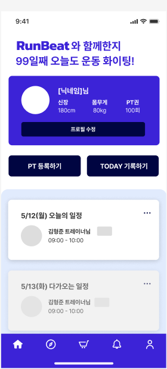

<div align="center">
   
</div>

</br>

# 🏃‍♂️ RunBeat 프로젝트

## Get started

1. Install dependencies

   ```bash
   npm install
   ```

2. Start the app

   ```bash
   npx expo start
   ```

In the output, you'll find options to open the app in a

- [Android emulator](https://docs.expo.dev/workflow/android-studio-emulator/)
- [Expo Go](https://expo.dev/go), a limited sandbox for trying out app development with Expo

</br>

## 🎬 화면 구성

### ✅ 메인 화면

|                             화면                              | 설명                                                                 |
| :-----------------------------------------------------------: | -------------------------------------------------------------------- |
|  | RunBeat App 시작 후 회원과 트레이너를 구분하여 로그인 할수 있습니다. |

### ✅ 유저 상세 화면

|                                 화면                                 | 설명                                                                                                                                       |
| :------------------------------------------------------------------: | ------------------------------------------------------------------------------------------------------------------------------------------ |
|          | 유저 로그인 시 들어가는 메인 페이지 입니다. </br> 프로필 수정, PT 등록, Today 기록 </br> 오늘의 일정과 다가오는 일정을 확인할 수 있습니다. |
|       | 회원 상세 정보 수정 및 로그아웃 회원 탈퇴가 가능합니다.                                                                                    |
|  | 식단 / 운동 영역을 선택해 본인의 스케쥴을 등록 가능합니다.                                                                                 |
|        | 원하는 날짜와 시간을 선택해 PT 등록 할 수 있습니다.                                                                                        |

</br>

### ✅ 트레이너 상세 화면

|                                  화면                                  | 설명                                                                                                    |
| :--------------------------------------------------------------------: | ------------------------------------------------------------------------------------------------------- |
|         | 트레이너 로그인 시 들어가는 메인 페이지 입니다. </br> 오늘의 일정과 다가오는 일정을 확인할 수 있습니다. |
|  | 유저가 PT를 신청하면 리스트 형태로 쭉 나옵니다.                                                         |
|       | 트레이너 쪽에서 보이는 PT 채팅 리스트로 담당 회원에 따라 채팅방 구분                                    |

### ✅ 공통 화면

|                             화면                             | 설명                                               |
| :----------------------------------------------------------: | -------------------------------------------------- |
|  | 채팅 페이지 / 해당 채팅으로 들어가면 보이는 페이지 |

<br/>

## ⚙ 기술 스택

### 🧩 Front-end

<div>


</div>

### 🧩 Back-end

<div>

</div>

### 🛠 Tools

<div>


</div>

<br/>

## 🤔 기술적 이슈와 해결 과정

- **Framer Motion 반응형 디자인**

  - 공식 문서([motion.dev](https://motion.dev))를 참고하여 애니메이션과 반응형 디자인을 구현하였습니다.

- **TypeScript 타입 관리**

  - 공통 타입을 정의하여 재사용성을 높였고, `Params` 등 라우터 관련 타입도 명확하게 설정하였습니다.

- **Navigation Bar 검색 기능**

  - 수업에서 진행한 Todo 프로젝트에서의 `localStorage` 적용을 참고하여 검색 기능 구현에 활용하였습니다.

- **Firebase 및 컴포넌트 분리**
  - 구글링 및 참고자료를 통해 Firebase 사용법을 익혔고, 기능별·타입별 컴포넌트 분리를 진행하였습니다.

<br/>

## 💻 기술 스택

| 구분           | 사용 기술                            |
| -------------- | ------------------------------------ |
| **Frontend**   | React Native, Expo, React Navigation |
| **Backend**    | **NestJS**, WebSocket                |
| **AI 연동**    | OpenAI API                           |
| **DB/Storage** | **MySQL**, AWS S3                    |
| **기타**       | Android Studio (에뮬레이터 테스트)   |

---

## 👥 팀원 역할

| 이름       | 역할 구분        | 담당 업무                                                                                           |
| ---------- | ---------------- | --------------------------------------------------------------------------------------------------- |
| **전유나** | Frontend         | - 디자인, 레이아웃 구성<br>- 회원 페이지<br>- 스케줄 페이지<br>- 채팅 페이지                        |
| **유가영** | Frontend         | - 애뮬레이터 연동<br>- 회원정보 페이지<br>- 예약 확인 모달                                          |
| **우현서** | Backend          | - 인증 / 인가 (NestJS 기반)<br>- OpenAI API 연동<br>- 웹소켓 채팅<br>- 서버 배포                    |
| **김형준** | Fullstack        | - 프로필 전체<br>- S3 연동<br>- API 연결 및 보조                                                    |
| **박준용** | Fullstack (팀장) | - 프론트 구조 설계<br>- 코드 리팩토링<br>- 자동 로그인 (리프레시 토큰)<br>- api 설계 및 데이터 연결 |

---

## 👨‍👩‍👧 프로젝트 팀원

|  이름  |                  GitHub                   |
| :----: | :---------------------------------------: |
| 박준용 |    [Ori0li](https://github.com/Ori0li)    |
| 전유나 | [Jeon-YuNa](https://github.com/Jeon-YuNa) |
| 김형준 |   [khj3535](https://github.com/khj3535)   |
| 유가영 |  [asom0160](https://github.com/asom0160)  |
| 우현서 | [hyunseo01](https://github.com/hyunseo01) |

---

## 🤔 해당 프로젝트 진행 과정

- **프로젝트 개발 진행 노션**

  - [RunBeat Final Project Notion](https://www.notion.so/Final-Project-RunBeat-1f1a9313c60c8040bcdae3db8d9716ea)

- **BackEnd 개발 진행 과정**

  - [RunBeat BackEnd](https://www.notion.so/1ec8186df78b80bba96be8b876d4aac2)

<br/>

## 📥 다운로드 링크

- **[RunBeat Downoad](https://drive.google.com/file/d/14cf9JYevNS9O5RKP6bo6RzqAMLw8L7h8/view)**
